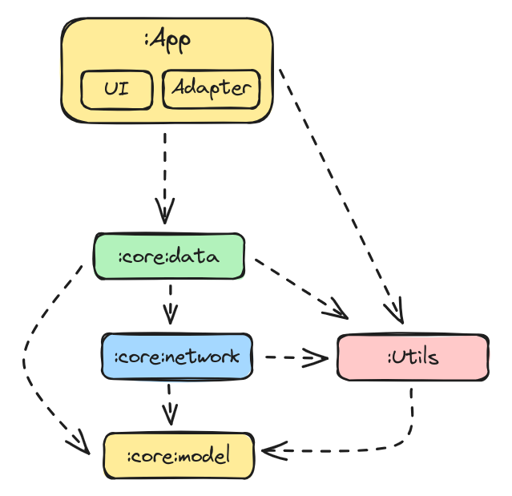
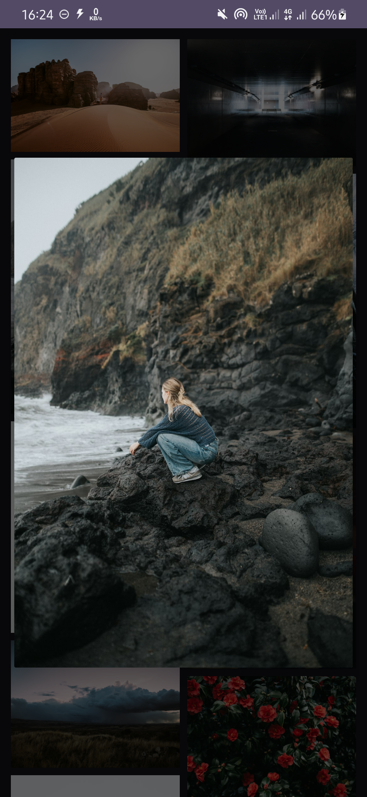

## Gallery App

### Libraries & Stack

All the libraries that used to build this project:
* MVVM (Model View ViewModel)
* API Client [Retrofit](https://square.github.io/retrofit/)
* Dependency Injection [Hilt](https://dagger.dev/hilt/)
* Image Loader [Glide](https://github.com/bumptech/glide)
* State Holder [LiveData](https://developer.android.com/topic/libraries/architecture/livedata) 

### Open API
this project using public API by [Unsplash](https://unsplash.com/documentation)

### Modularization
Modularization that already implemented in this project:

### Screenshoot
 